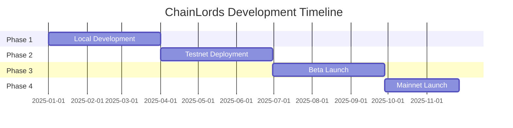

# Notion Templates for ChainLords

Copy these templates into your Notion workspace. Each template is formatted in Notion's markdown style.

## 📊 Sprint Dashboard Template

```markdown
# Sprint {NUMBER} Dashboard

## 📅 Sprint Information
**Duration**: {START_DATE} - {END_DATE}
**Sprint Goal**: {ONE_SENTENCE_GOAL}
**Team Capacity**: {TOTAL_STORY_POINTS} points

## 📈 Progress Tracker
| Metric | Target | Current | Status |
|--------|--------|---------|--------|
| Story Points | 40 | 0 | 🔴 Not Started |
| Features | 5 | 0 | 🔴 Not Started |
| Bugs Fixed | 3 | 0 | 🔴 Not Started |
| Tests Written | 20 | 0 | 🔴 Not Started |

## 🎯 Sprint Backlog
### High Priority
- [ ] Task 1 (Story points: X)
- [ ] Task 2 (Story points: X)

### Medium Priority
- [ ] Task 3 (Story points: X)
- [ ] Task 4 (Story points: X)

### Low Priority
- [ ] Task 5 (Story points: X)

## 🚧 Blockers
- None currently

## 📝 Daily Standup Notes
### Day 1 - {DATE}
**Yesterday**: Sprint planning
**Today**: Starting on Task 1
**Blockers**: None

## 🔗 Quick Links
- [GitHub Project Board](https://github.com/orgs/ThingyLingyGames/projects)
- [Sprint Planning Doc](#)
- [Retrospective Notes](#)
```

## 💡 Feature Brainstorming Template

```markdown
# Feature: {FEATURE_NAME}

## 📝 Overview
**Date**: {DATE}
**Participants**: @{NAMES}
**Status**: 🟡 In Discussion

## 🎯 Problem Statement
What problem are we trying to solve?

## 👤 User Stories
As a {USER_TYPE}, I want to {ACTION} so that {BENEFIT}.

### Acceptance Criteria
- [ ] Criteria 1
- [ ] Criteria 2
- [ ] Criteria 3

## 💭 Ideas & Concepts
### Option 1: {NAME}
**Description**: 
**Pros**: 
**Cons**: 
**Effort**: Low/Medium/High

### Option 2: {NAME}
**Description**: 
**Pros**: 
**Cons**: 
**Effort**: Low/Medium/High

## 🎨 Visual Concepts
[Insert sketches/mockups]

## 🔧 Technical Considerations
- **Architecture Impact**: 
- **Dependencies**: 
- **Performance**: 
- **Security**: 

## 📊 Success Metrics
- Metric 1: 
- Metric 2: 
- Metric 3: 

## 🗳️ Decision
**Selected Option**: 
**Reasoning**: 

## 📋 Action Items
- [ ] Create detailed design doc
- [ ] Create GitHub issues
- [ ] Estimate story points
- [ ] Add to sprint backlog
```

## 🏗️ Architecture Decision Record (ADR) Template

```markdown
# ADR-{NUMBER}: {TITLE}

## Status
🟢 Accepted | 🟡 Proposed | 🔴 Rejected | ⚪ Superseded

## Context
What is the issue we're seeing that motivates this decision?

## Decision
What is the change that we're proposing/doing?

## Consequences
### Positive
- Benefit 1
- Benefit 2

### Negative
- Drawback 1
- Drawback 2

### Neutral
- Side effect 1
- Side effect 2

## Alternatives Considered
### Option 1: {NAME}
- **Description**: 
- **Pros**: 
- **Cons**: 
- **Why not chosen**: 

### Option 2: {NAME}
- **Description**: 
- **Pros**: 
- **Cons**: 
- **Why not chosen**: 

## Implementation
```code
// Example code or configuration
```

## References
- [Link to relevant documentation]
- [Link to discussion thread]
```

## 📚 Knowledge Base Article Template

```markdown
# {TOPIC_TITLE}

## 📖 Overview
Brief introduction to the topic.

## 🎯 Purpose
Why is this important for ChainLords?

## 📝 Detailed Explanation
### Concept 1
Explanation...

### Concept 2
Explanation...

## 💻 Code Examples
```javascript
// Example code
```

## 🔧 Implementation Guide
1. Step 1
2. Step 2
3. Step 3

## ⚠️ Common Pitfalls
- Pitfall 1 and how to avoid
- Pitfall 2 and how to avoid

## 📊 Best Practices
- Practice 1
- Practice 2
- Practice 3

## 🔗 Related Resources
- [Internal Link 1]
- [External Link 2]
- [Documentation Link 3]

## 🏷️ Tags
#topic #category #technology
```

## 📅 Sprint Retrospective Template

```markdown
# Sprint {NUMBER} Retrospective

## 📊 Sprint Summary
**Duration**: {START} - {END}
**Completed Story Points**: {X}/{Y}
**Team Satisfaction**: ⭐⭐⭐⭐☆

## 😊 What Went Well
- Success 1
- Success 2
- Success 3

## 😕 What Could Be Improved
- Issue 1
- Issue 2
- Issue 3

## 💡 Ideas for Next Sprint
- Idea 1
- Idea 2
- Idea 3

## 📈 Metrics
| Metric | Target | Actual | Trend |
|--------|--------|--------|-------|
| Velocity | 40 | 35 | 📈 |
| Bug Rate | <5 | 3 | ✅ |
| Test Coverage | >80% | 85% | ✅ |

## 🎯 Action Items
- [ ] Action 1 - @owner
- [ ] Action 2 - @owner
- [ ] Action 3 - @owner

## 💭 Team Feedback
### Developer 1
- **Highlight**: 
- **Lowlight**: 

### Developer 2
- **Highlight**: 
- **Lowlight**: 

## 📝 Notes for Next Sprint
Important context to remember...
```

## 🚀 Product Roadmap Template

```markdown
# ChainLords Product Roadmap

## 🎯 Vision
One-sentence product vision.

## 📅 Timeline Overview


## 🏁 Milestones

### Q1 2025: Foundation
- [ ] Core smart contracts
- [ ] Basic frontend
- [ ] Authentication system
- [ ] Local testing environment

### Q2 2025: Alpha
- [ ] Testnet deployment
- [ ] Full game loop
- [ ] NFT integration
- [ ] Basic multiplayer

### Q3 2025: Beta
- [ ] Public beta launch
- [ ] Cross-chain bridges
- [ ] Advanced features
- [ ] Community building

### Q4 2025: Launch
- [ ] Mainnet deployment
- [ ] Marketing campaign
- [ ] Mobile app
- [ ] DAO formation

## 📊 Success Metrics
- **Q1**: Development environment complete
- **Q2**: 100 alpha testers
- **Q3**: 1,000 beta users
- **Q4**: 10,000 active players

## 🚧 Risks & Mitigation
| Risk | Impact | Probability | Mitigation |
|------|--------|-------------|------------|
| Technical debt | High | Medium | Regular refactoring |
| Security issues | Critical | Low | Audits and testing |
| Low adoption | High | Medium | Marketing strategy |

## 🔄 Review Schedule
- Monthly milestone reviews
- Quarterly roadmap updates
- Annual strategy revision
```

## 🐛 Bug Report Template

```markdown
# Bug: {BUG_TITLE}

## 📝 Description
Clear description of the bug.

## 🔄 Steps to Reproduce
1. Step 1
2. Step 2
3. Step 3

## 🎯 Expected Behavior
What should happen?

## ❌ Actual Behavior
What actually happens?

## 📸 Screenshots/Videos
[Attach media if applicable]

## 🌍 Environment
- **Browser**: Chrome 120
- **Wallet**: MetaMask v11
- **Network**: Sepolia testnet
- **OS**: Windows 11

## 📊 Impact
- **Severity**: 🔴 Critical | 🟠 High | 🟡 Medium | 🟢 Low
- **Frequency**: Always | Often | Sometimes | Rarely
- **Users Affected**: All | Some | Few

## 🔍 Initial Investigation
Any findings or hypotheses about the cause.

## 🏷️ Labels
#bug #frontend #urgent
```

## 🎯 Sprint Planning Checklist

```markdown
# Sprint {NUMBER} Planning Checklist

## 📅 Pre-Planning (2 days before)
- [ ] Review previous sprint retrospective
- [ ] Groom backlog items
- [ ] Check team availability
- [ ] Prepare sprint goal options

## 🎯 During Planning
### Part 1: Sprint Goal (30 min)
- [ ] Review product roadmap
- [ ] Discuss and agree on sprint goal
- [ ] Document goal clearly

### Part 2: Capacity Planning (15 min)
- [ ] Calculate team capacity
- [ ] Account for holidays/time off
- [ ] Set realistic targets

### Part 3: Backlog Selection (45 min)
- [ ] Review prioritized backlog
- [ ] Estimate story points
- [ ] Select items for sprint
- [ ] Ensure all items have acceptance criteria

### Part 4: Task Breakdown (30 min)
- [ ] Break down user stories
- [ ] Identify dependencies
- [ ] Assign initial owners
- [ ] Create tasks in GitHub

## 📋 Post-Planning
- [ ] Update project board
- [ ] Send sprint plan to team
- [ ] Schedule daily standups
- [ ] Set up sprint review meeting

## 📊 Sprint Metrics to Track
- Total story points committed: ___
- Number of user stories: ___
- Technical debt items: ___
- Bug fixes planned: ___
```

## 💼 Meeting Notes Template

```markdown
# Meeting: {MEETING_TITLE}

## 📅 Details
**Date**: {DATE}
**Time**: {TIME}
**Duration**: {DURATION}
**Attendees**: @{NAMES}
**Type**: Stand-up | Planning | Review | Retrospective | Brainstorming

## 📝 Agenda
1. Item 1
2. Item 2
3. Item 3

## 💬 Discussion

### Topic 1: {TOPIC}
**Discussion**: 
**Decision**: 
**Action Items**: 
- [ ] Action - @owner

### Topic 2: {TOPIC}
**Discussion**: 
**Decision**: 
**Action Items**: 
- [ ] Action - @owner

## 🎯 Key Decisions
1. Decision 1
2. Decision 2

## 📋 Action Items Summary
- [ ] Action 1 - @owner - Due: DATE
- [ ] Action 2 - @owner - Due: DATE
- [ ] Action 3 - @owner - Due: DATE

## 📅 Next Meeting
**Date**: {DATE}
**Topics**: {TOPICS}

## 📎 Attachments
- [Link to recording]
- [Link to slides]
```

## How to Import These Templates

1. **Create a New Page** in Notion
2. **Copy the template** markdown
3. **Paste** into the Notion page
4. **Customize** with your specific information
5. **Save as Template** for reuse

### Pro Tips:
- Use Notion's database feature for sprints, bugs, and features
- Create linked relations between databases
- Set up filtered views for different team members
- Use Notion's API to sync with other tools
- Create recurring templates for regular meetings