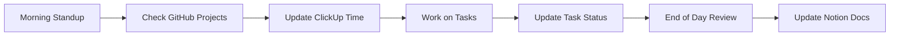

# Project Management Setup Guide

This guide covers the complete setup and integration of our project management tools: GitHub Projects, Notion, and ClickUp.

## 🛠️ Tool Overview

| Tool | Purpose | Cost |
|------|---------|------|
| **GitHub Projects** | Primary task tracking, sprint planning | Free |
| **Notion** | Documentation, brainstorming, knowledge base | Free tier |
| **ClickUp** | Advanced views, time tracking, automation | Free tier |

## 📋 GitHub Projects Setup

### 1. Create Project Board
1. Go to https://github.com/ThingyLingyGames/chainlords
2. Click on "Projects" tab
3. Click "New project"
4. Select "Board" template
5. Name it "ChainLords Development"

### 2. Configure Columns
Create these columns in order:
- 📋 **Backlog** - All unplanned tasks
- 🎯 **Sprint Ready** - Prioritized for next sprint
- 🚀 **In Progress** - Currently being worked on
- 👀 **In Review** - Awaiting code review
- ✅ **Done** - Completed tasks

### 3. Add Custom Fields
Click ⚙️ Settings → Custom fields:
- **Story Points** (Number): 1, 2, 3, 5, 8, 13
- **Priority** (Single select): 🔴 Critical, 🟠 High, 🟡 Medium, 🟢 Low
- **Component** (Single select): Smart Contracts, Backend, Frontend, Docs
- **Sprint** (Text): Sprint 1, Sprint 2, etc.

### 4. Create Labels
Go to Issues → Labels and create:
- `epic` - Large features spanning multiple sprints
- `bug` - Something isn't working
- `enhancement` - New feature or request
- `documentation` - Documentation improvements
- `good first issue` - Good for newcomers
- `help wanted` - Extra attention needed
- `blocked` - Blocked by external dependency

### 5. Automation Rules
Settings → Workflows:
```yaml
# Auto-move to "In Progress" when assigned
- When: Issue assigned
  Then: Move to "In Progress"

# Auto-move to "Done" when closed
- When: Issue closed
  Then: Move to "Done"

# Auto-add to project when labeled
- When: Label "sprint-ready" added
  Then: Add to project
```

### 6. Sprint Planning Template
Create an issue template for sprints:
```markdown
---
name: Sprint Planning
about: Template for sprint planning sessions
title: 'Sprint [NUMBER] Planning'
labels: 'sprint-planning'
---

## Sprint Goal
[One sentence describing the main objective]

## Dates
- Start: YYYY-MM-DD
- End: YYYY-MM-DD

## Capacity
- Total story points: XX
- Team availability: XX%

## Committed Items
- [ ] #issue-number - Task description (X points)
- [ ] #issue-number - Task description (X points)

## Stretch Goals
- [ ] #issue-number - Task description (X points)

## Notes
[Any additional context or dependencies]
```

## 🧠 Notion Workspace Setup

### 1. Create Workspace Structure
```
ChainLords HQ/
├── 🏠 Dashboard
├── 📅 Sprint Management
├── 🎯 Product Roadmap
├── 💡 Brainstorming
├── 📚 Knowledge Base
├── 🏗️ Architecture Decisions
└── 📊 Analytics & Reports
```

### 2. Dashboard Page
Create a main dashboard with:
- Current sprint overview
- Key metrics
- Quick links
- Team calendar

```markdown
# ChainLords Dashboard

## 🎯 Current Sprint
[Embed sprint board]

## 📊 Key Metrics
- Story Points Completed: XX/XX
- Bugs Fixed: XX
- Features Shipped: XX

## 🔗 Quick Links
- [GitHub Repo](https://github.com/ThingyLingyGames/chainlords)
- [Live Demo](https://demo.chainlords.io)
- [API Docs](../api)

## 📅 Upcoming
- [ ] Sprint Review - DATE
- [ ] Planning Session - DATE
- [ ] Demo Day - DATE
```

### 3. Sprint Database
Create a database with these properties:
- Sprint Number (Number)
- Start Date (Date)
- End Date (Date)
- Goal (Text)
- Story Points (Number)
- Status (Select: Planning, Active, Completed)
- Retrospective (Text)

### 4. Knowledge Base Structure
```
Knowledge Base/
├── 🎮 Game Mechanics
│   ├── Combat System
│   ├── Resource Management
│   └── Progression System
├── 🔧 Technical Guides
│   ├── Smart Contract Patterns
│   ├── API Best Practices
│   └── Performance Tips
├── 🎨 Design System
│   ├── UI Components
│   ├── Color Palette
│   └── Typography
└── 📝 Meeting Notes
    ├── Sprint Reviews
    ├── Retrospectives
    └── Brainstorming Sessions
```

### 5. Templates

#### Feature Brainstorming Template
```markdown
# Feature: [Name]
Date: YYYY-MM-DD
Participants: @names

## 💡 Idea
[Brief description]

## 🎯 User Story
As a [user type], I want to [action] so that [benefit].

## ✅ Acceptance Criteria
- [ ] Criteria 1
- [ ] Criteria 2
- [ ] Criteria 3

## 🎨 Mockups
[Insert images/sketches]

## 🔧 Technical Considerations
- Architecture impact
- Dependencies
- Estimated effort

## 💬 Discussion
[Meeting notes]

## 📋 Next Steps
- [ ] Create GitHub issues
- [ ] Technical spike needed?
- [ ] Design review
```

## 📊 ClickUp Configuration

### 1. Workspace Hierarchy
```
ChainLords/
├── 🚀 Development
│   ├── Smart Contracts
│   ├── Backend
│   ├── Frontend
│   └── Infrastructure
├── 🎨 Design
│   ├── UI/UX
│   ├── Game Assets
│   └── Marketing
├── 📈 Analytics
└── 🐛 Bug Tracking
```

### 2. Custom Fields Setup
- **Story Points**: Number field (Fibonacci)
- **Priority**: Dropdown (P0-P3)
- **Component**: Tags
- **Sprint**: Text field
- **Time Estimate**: Duration
- **Actual Time**: Duration
- **AI-Assisted**: Checkbox

### 3. Views Configuration

#### Sprint Board (Kanban)
- Group by: Status
- Filter: Current Sprint
- Show: Story points, Assignee

#### Development Roadmap (Gantt)
- Timeline: 6 months
- Dependencies: Show all
- Milestones: Major releases

#### Bug Tracker (Table)
- Columns: Title, Priority, Component, Status, Reporter
- Sort: Priority (High to Low)
- Filter: Type = Bug

#### Time Tracking (Dashboard)
- Widget 1: Time by person
- Widget 2: Time by component
- Widget 3: Estimated vs Actual
- Widget 4: Velocity chart

### 4. Automation Rules

```yaml
# Auto-assign based on component
When: Task created with tag "smart-contract"
Then: Assign to smart contract developer

# Move to review when PR created
When: GitHub PR linked
Then: Change status to "In Review"

# Daily standup reminder
When: Every weekday at 9 AM
Then: Post message in Discord

# Sprint completion
When: All tasks in sprint completed
Then: Generate sprint report
```

### 5. Integration Setup

#### GitHub Integration
1. Go to ClickUp Settings → Integrations
2. Select GitHub
3. Authorize ThingyLingyGames organization
4. Map ClickUp tasks to GitHub issues

#### Notion Integration (via Zapier)
1. Create Zapier account (free tier)
2. Create Zap: ClickUp Task Created → Notion Page Created
3. Map fields appropriately

## 🔄 Workflow Integration

### Daily Workflow


### Sprint Workflow
1. **Sprint Planning** (Notion)
   - Brainstorm and prioritize features
   - Create user stories
   - Estimate story points

2. **Task Creation** (GitHub)
   - Convert stories to GitHub issues
   - Add to project board
   - Assign to developers

3. **Development** (ClickUp)
   - Track time spent
   - Update progress
   - View advanced analytics

4. **Documentation** (Notion)
   - Update knowledge base
   - Document decisions
   - Create guides

### Weekly Routines
- **Monday**: Sprint planning/review
- **Wednesday**: Mid-sprint check-in
- **Friday**: Demo and retrospective

## 📱 Mobile Access

### GitHub
- Download GitHub mobile app
- Enable notifications for mentions

### Notion
- Download Notion mobile app
- Offline access for key documents

### ClickUp
- Download ClickUp mobile app
- Time tracking on the go

## 🎯 Best Practices

### Task Management
1. Every task should have:
   - Clear description
   - Acceptance criteria
   - Story points estimate
   - Component label

2. Use consistent naming:
   - Features: `feat: [component] description`
   - Bugs: `fix: [component] description`
   - Docs: `docs: description`

### Communication
- Daily updates in Discord
- Weekly progress in Notion
- Sprint reviews recorded

### Time Management
- Log time daily in ClickUp
- Review estimates vs actuals
- Adjust future estimates

## 🚀 Getting Started Checklist

- [ ] Accept GitHub project invitation
- [ ] Join Notion workspace
- [ ] Create ClickUp account and join workspace
- [ ] Install mobile apps
- [ ] Review this guide
- [ ] Attend onboarding session
- [ ] Create your first task!

## 📚 Additional Resources

- [Agile Development Guide](../guides/agile-development.md)
- [GitHub Projects Documentation](https://docs.github.com/en/issues/planning-and-tracking-with-projects)
- [Notion Templates Gallery](https://notion.so/templates)
- [ClickUp University](https://university.clickup.com)