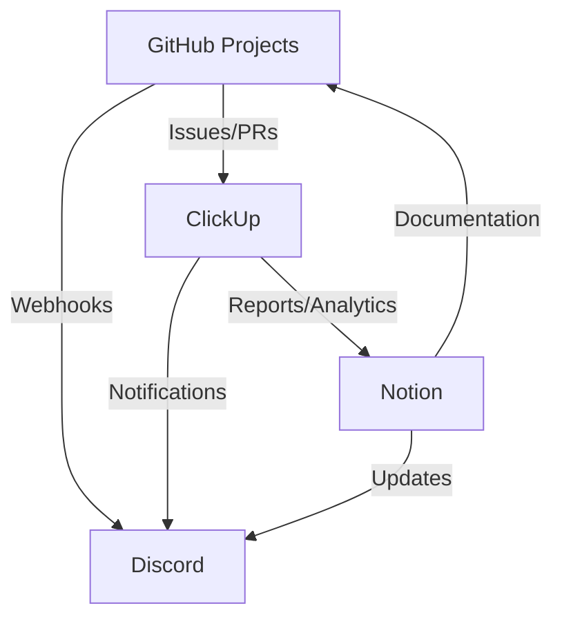
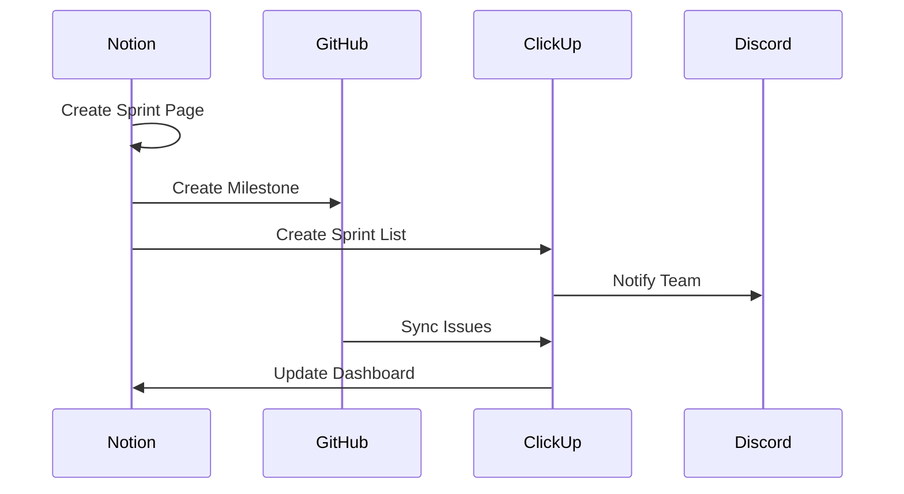
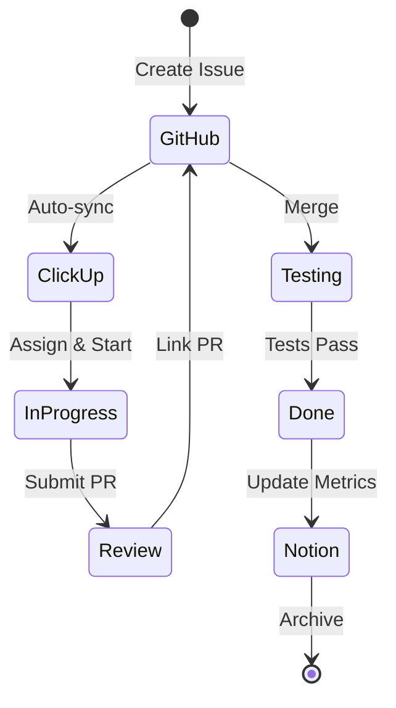

# Project Management Tool Integration Guide

This guide explains how to integrate GitHub Projects, Notion, and ClickUp for a seamless workflow.

## 🔄 Integration Overview



## 🔗 Integration Points

### Primary Workflows

| Task | Primary Tool | Secondary Tool | Integration |
|------|-------------|----------------|-------------|
| Task Creation | GitHub Issues | ClickUp | Auto-sync |
| Sprint Planning | Notion | GitHub Projects | Manual transfer |
| Time Tracking | ClickUp | - | Reports to Notion |
| Documentation | Notion | GitHub Wiki | Cross-links |
| Code Review | GitHub | ClickUp | Status sync |
| Retrospectives | Notion | - | Links to GitHub |

## 🛠️ Setting Up Integrations

### 1. GitHub ↔ ClickUp Integration

#### Automatic Setup
```bash
# Using ClickUp's native integration
1. Go to ClickUp Settings → Integrations
2. Select GitHub
3. Authorize ThingyLingyGames organization
4. Select repositories: chainlords
5. Configure field mappings
```

#### Field Mappings
```yaml
GitHub Issue → ClickUp Task:
  - Title → Title
  - Body → Description
  - Labels → Tags + Component
  - Assignee → Assignee
  - Milestone → Sprint
  - Issue Number → Custom Field

ClickUp Status → GitHub Label:
  - In Progress → "in-progress"
  - Code Review → "needs-review"
  - Done → Close Issue
```

#### Webhook Configuration
Create `.github/workflows/clickup-sync.yml`:
```yaml
name: Sync with ClickUp

on:
  issues:
    types: [opened, edited, closed, assigned]
  pull_request:
    types: [opened, edited, closed, review_requested]

jobs:
  sync:
    runs-on: ubuntu-latest
    steps:
      - name: Sync to ClickUp
        uses: clickup/github-actions@v1
        with:
          clickup-token: ${{ secrets.CLICKUP_TOKEN }}
          action: sync
```

### 2. Notion ↔ GitHub Integration (via Zapier)

#### Create Zaps

**Zap 1: GitHub Issue → Notion Database**
```
Trigger: New Issue in GitHub
Actions:
  1. Create Database Item in Notion
  2. Map fields:
     - Issue Title → Name
     - Issue Body → Description
     - Labels → Tags
     - Issue URL → GitHub Link
```

**Zap 2: Notion Sprint → GitHub Milestone**
```
Trigger: New Sprint in Notion
Actions:
  1. Create Milestone in GitHub
  2. Map fields:
     - Sprint Name → Milestone Title
     - Sprint Goal → Description
     - End Date → Due Date
```

### 3. ClickUp ↔ Notion Integration

#### Using Make.com (formerly Integromat)
```
Scenario 1: Daily Sync
Trigger: Every day at 6 AM
Actions:
  1. Get ClickUp tasks (completed yesterday)
  2. Update Notion metrics database
  3. Calculate velocity
  4. Update dashboard

Scenario 2: Sprint Reports
Trigger: End of sprint (Friday 5 PM)
Actions:
  1. Generate ClickUp report
  2. Create Notion page from template
  3. Populate with metrics
  4. Send notification
```

### 4. Discord Notifications

#### GitHub Webhooks
```bash
# In Discord server settings
1. Create webhooks for channels:
   - #dev-updates
   - #pull-requests
   - #releases

2. In GitHub repository settings:
   - Add webhook URL
   - Select events:
     - Issues
     - Pull requests
     - Releases
     - Deployments
```

#### ClickUp Webhooks
```javascript
// ClickUp webhook handler
const webhook = {
  url: "YOUR_DISCORD_WEBHOOK_URL",
  events: [
    "taskCreated",
    "taskUpdated",
    "taskCommentPosted"
  ],
  filters: {
    priority: ["P0", "P1"],
    status_change: true
  }
};
```

#### Notion Webhooks (via Zapier)
```
Trigger: Page Updated in Notion
Filter: Database = "Sprints" OR "Features"
Action: Send Discord Message
Template: "{Page} was updated by {User}"
```

## 📊 Unified Dashboard

### Creating a Master Dashboard in Notion

```markdown
# ChainLords Master Dashboard

## 📈 Current Sprint (from ClickUp)
{{Embed ClickUp Dashboard}}

## 🐙 GitHub Activity
{{GitHub Activity Widget}}

## 📊 Key Metrics
| Metric | This Week | Last Week | Trend |
|--------|-----------|-----------|-------|
| Story Points | {{ClickUp}} | {{ClickUp}} | {{Calculate}} |
| PRs Merged | {{GitHub}} | {{GitHub}} | {{Calculate}} |
| Bugs Fixed | {{GitHub}} | {{GitHub}} | {{Calculate}} |
| Test Coverage | {{GitHub}} | {{GitHub}} | {{Calculate}} |

## 🎯 Upcoming Milestones
{{GitHub Milestones API}}

## 📝 Recent Updates
{{Activity Feed from all sources}}
```

### API Integration Script
```javascript
// notion-dashboard-updater.js
const { Client } = require('@notionhq/client');
const { Octokit } = require('@octokit/rest');
const axios = require('axios');

// Initialize clients
const notion = new Client({ auth: process.env.NOTION_TOKEN });
const octokit = new Octokit({ auth: process.env.GITHUB_TOKEN });
const clickupAPI = axios.create({
  baseURL: 'https://api.clickup.com/api/v2',
  headers: { 'Authorization': process.env.CLICKUP_TOKEN }
});

async function updateDashboard() {
  // Fetch GitHub metrics
  const { data: issues } = await octokit.issues.listForRepo({
    owner: 'ThingyLingyGames',
    repo: 'chainlords',
    state: 'all',
    since: lastWeek()
  });

  // Fetch ClickUp metrics
  const { data: tasks } = await clickupAPI.get('/team/TEAM_ID/task');

  // Update Notion dashboard
  await notion.pages.update({
    page_id: DASHBOARD_PAGE_ID,
    properties: {
      'Story Points': { number: calculateStoryPoints(tasks) },
      'PRs Merged': { number: countMergedPRs(issues) },
      'Last Updated': { date: { start: new Date().toISOString() } }
    }
  });
}

// Run every hour
setInterval(updateDashboard, 3600000);
```

## 🔄 Workflow Automations

### 1. Sprint Initialization


### 2. Task Lifecycle


### 3. Daily Standup Automation
```yaml
# Runs every weekday at 9 AM
Daily Standup:
  1. ClickUp: Generate task updates
  2. GitHub: Fetch PR status
  3. Notion: Create standup note
  4. Discord: Post summary
  
Template: |
  ## Daily Standup - {DATE}
  
  ### 🚀 In Progress
  {ClickUp tasks with status "In Progress"}
  
  ### 👀 Awaiting Review
  {GitHub PRs awaiting review}
  
  ### ✅ Completed Yesterday
  {ClickUp tasks completed yesterday}
  
  ### 🚫 Blockers
  {ClickUp tasks with status "Blocked"}
```

## 📱 Mobile Workflow

### Quick Actions Setup

#### iOS Shortcuts
```javascript
// Create Task Shortcut
1. Open Shortcuts app
2. Create new shortcut
3. Add actions:
   - Text input: "Task title"
   - Get Contents of URL:
     - URL: ClickUp API
     - Method: POST
     - Headers: Authorization
     - Body: Task JSON
4. Add to Home Screen
```

#### Android Tasker
```xml
<TaskerData>
  <Task>
    <name>Create ChainLords Task</name>
    <Action>
      <code>547</code> <!-- HTTP Post -->
      <arg1>https://api.clickup.com/api/v2/list/LIST_ID/task</arg1>
      <arg2>Authorization: YOUR_TOKEN</arg2>
      <arg3>{"name": "%input", "status": "backlog"}</arg3>
    </Action>
  </Task>
</TaskerData>
```

## 🎯 Best Practices

### 1. Single Source of Truth
- **Tasks**: GitHub Issues
- **Time**: ClickUp
- **Docs**: Notion
- **Code**: GitHub

### 2. Automation Rules
- Automate repetitive tasks
- Keep manual oversight for critical decisions
- Regular automation audits
- Document all automations

### 3. Communication Flow
```
GitHub Commit → GitHub Issue Update → ClickUp Sync → Discord Notification
                                   ↓
                          Notion Dashboard Update
```

### 4. Data Hygiene
- Weekly sync verification
- Monthly data cleanup
- Quarterly automation review
- Archive old data

## 🛠️ Troubleshooting

### Sync Issues

#### GitHub ↔ ClickUp
```bash
# Check webhook delivery
curl -H "Authorization: token YOUR_GITHUB_TOKEN" \
  https://api.github.com/repos/ThingyLingyGames/chainlords/hooks

# Test ClickUp API
curl -H "Authorization: YOUR_CLICKUP_TOKEN" \
  https://api.clickup.com/api/v2/team
```

#### Notion Sync
```javascript
// Test Notion connection
const { Client } = require('@notionhq/client');
const notion = new Client({ auth: process.env.NOTION_TOKEN });

notion.databases.query({
  database_id: YOUR_DATABASE_ID
}).then(console.log).catch(console.error);
```

### Performance Optimization
1. Use webhooks instead of polling
2. Batch API requests
3. Cache frequently accessed data
4. Implement retry logic
5. Monitor API rate limits

## 📚 Advanced Integrations

### Custom GitHub Action
```yaml
name: Advanced Project Sync

on:
  workflow_dispatch:
  schedule:
    - cron: '0 */6 * * *'

jobs:
  sync-all:
    runs-on: ubuntu-latest
    steps:
      - uses: actions/checkout@v3
      
      - name: Sync GitHub to ClickUp
        run: |
          npm install
          node scripts/sync-github-clickup.js
          
      - name: Update Notion Dashboard
        run: |
          node scripts/update-notion-dashboard.js
          
      - name: Generate Reports
        run: |
          node scripts/generate-reports.js
          
      - name: Notify Discord
        run: |
          curl -X POST ${{ secrets.DISCORD_WEBHOOK }} \
            -H "Content-Type: application/json" \
            -d '{"content": "✅ Project sync completed"}'
```

### Unified CLI Tool
```bash
#!/bin/bash
# chainlords-cli - Unified project management CLI

case $1 in
  "task")
    # Create task in GitHub and sync everywhere
    gh issue create --title "$2" --body "$3"
    ;;
  "sprint")
    # Initialize new sprint across all tools
    ./scripts/init-sprint.sh "$2"
    ;;
  "report")
    # Generate unified report
    ./scripts/generate-report.sh
    ;;
  "sync")
    # Force sync all integrations
    ./scripts/force-sync.sh
    ;;
esac
```

## 🎉 Integration Success Checklist

- [ ] GitHub ↔ ClickUp two-way sync working
- [ ] Notion dashboards auto-updating
- [ ] Discord notifications configured
- [ ] Mobile apps connected
- [ ] Automation scripts deployed
- [ ] Team trained on workflow
- [ ] Documentation complete
- [ ] Backup procedures in place
- [ ] Monitoring active
- [ ] First sprint running smoothly

With these integrations in place, your project management will be streamlined and efficient!